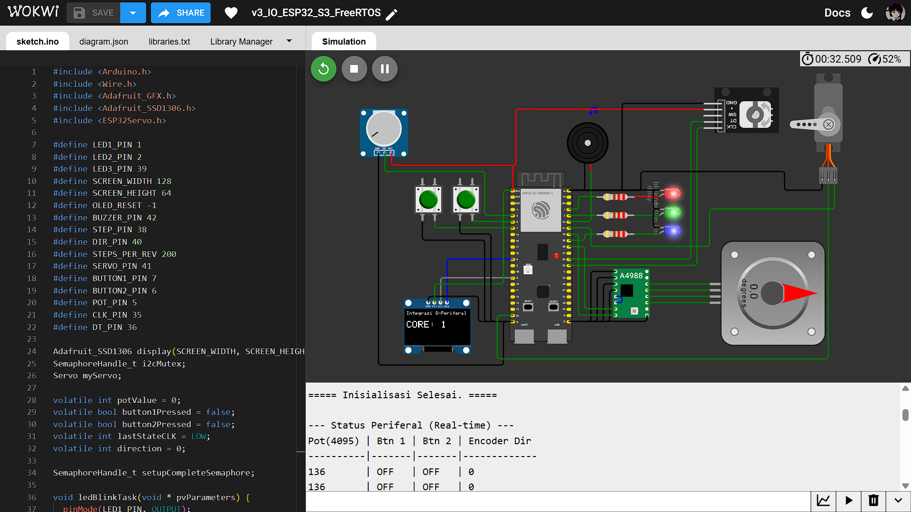
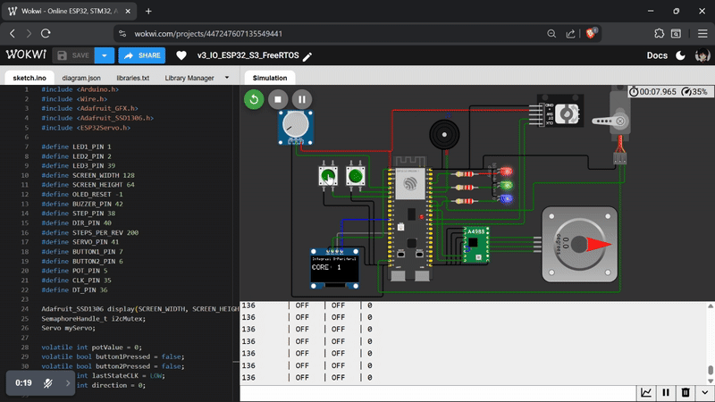

## Percobaan 8: Integrasi All Peripheral (Multi-Tasking) Dual Core
**Nama:** Rifqi Raehan Hermawan \
**NRP:** 3223600004 \
**Kelas:** 3 D4 Teknik Komputer A

Percobaan integrasi dari semua 8 periferal (3x LED, Buzzer, OLED, Stepper, Servo, 2x Button, Potentiometer, Encoder) ke dalam satu program. Tujuannya adalah untuk menjalankan semua periferal secara bersamaan (concurrently) tanpa saling memblokir, menggunakan arsitektur dual-core FreeRTOS dengan program Task untuk masing-masing peripheral.

## Penjelasan Kode

### 1. Definisi Pin, Library, dan Objek Global
Melakukan import library yang diperlukan (`Wire`, `Adafruit_SSD1306`, `ESP32Servo`) dan mendefinisikan semua pin.
```c
// Definisi Pin (8 periferal)
#define LED1_PIN 1
#define LED2_PIN 2
#define LED3_PIN 39
#define BUZZER_PIN 42
#define STEP_PIN 38
#define DIR_PIN  40
#define SERVO_PIN 41
#define BUTTON1_PIN 7
#define BUTTON2_PIN 6
#define POT_PIN 5
#define CLK_PIN 35
#define DT_PIN 36
// ...
// Objek Global
Adafruit_SSD1306 display(...);
Servo myServo;
// ...
// Variabel Komunikasi Antar-Task
volatile int potValue = 0;
volatile bool button1Pressed = false;
// ...
````

Variabel `volatile` sangat penting untuk komunikasi yang aman antar-task (misalnya, antara `readPotTask` di Core 0 dan `loggingTask` di Core 1).

### 2. Arsitektur Dual Core (Pembagian Task)

Untuk efisiensi maksimum, beban kerja dibagi antara kedua core:

  * **Core 0 (I/O Cepat & Sensitif):** Diberi tugas untuk membaca input yang sensitif terhadap waktu dan tidak boleh terganggu, seperti `readEncoderTask`, `readButton1Task`, dan `readPotTask`. Task ini memiliki prioritas lebih tinggi.
  * **Core 1 (Aplikasi & Aksi):** Diberi tugas untuk menjalankan aksi yang lebih "lambat" atau *blocking*, seperti `stepperTask`, `servoTask`, `ledBlinkTask`, `buzzerTask`, dan `oledTask`. Core ini juga menangani `loggingTask`.

### 3. Sinkronisasi dan Shared Resources

Dua mekanisme sinkronisasi kritis diimplementasikan:

1.  **`i2cMutex (Mutex)`:** Menggunakan Mutex (sebagai 'key') (`SemaphoreHandle_t`) dibuat untuk melindungi bus I2C. Task apa pun (seperti `oledTask` atau task lainnya) harus "mengambil" key ini sebelum menggunakan `display.display()` dan "mengembalikan" key setelah selesai, untuk mencegah dua task mengakses OLED secara bersamaan dan menyebabkan *crash*.
2.  **`setupCompleteSemaphore (Semaphore)`:** Menggunakan Binary Semaphore (sebagai 'gate' sinkronisasi) (`SemaphoreHandle_t`) yang digunakan untuk memperbaiki *Race Condition* pada log serial. `setup()` membuat "gate" ini dalam keadaan terkunci. `loggingTask` akan langsung diblokir saat mencoba melewatinya. Hanya setelah `setup()` selesai mencetak semua log inisialisasi statis, ia akan "membuka gate" (`xSemaphoreGive`), yang mengizinkan `loggingTask` untuk mulai mencetak data *real-time*.

### 4. Penjelasan Task (Ringkasan)

  * **Task Input (`read...Task`):** Task seperti `readEncoderTask` dan `readButton1Task` dibuat "bisu" (silent). Mereka tidak lagi mencetak ke Serial. Tugas mereka hanya satu: membaca sensor secepat mungkin dan memperbarui variabel `volatile` (misal: `direction` atau `button1Pressed`).
  * **Task Aksi (`led...`, `stepper...`, dll.):** Task ini berjalan secara independen di Core 1, melakukan aksi fisik (kedip, putar, bip) menggunakan `vTaskDelay` atau `delayMicroseconds` tanpa mengganggu task input di Core 0.
  * **`loggingTask` (Task Logging Khusus):** Task ini berjalan di Core 1 setiap 250ms. Ini adalah *satu-satunya* task yang bertanggung jawab membaca semua variabel `volatile` (potValue, button1Pressed, dll.) dan mencetaknya ke Serial Monitor dalam format tabel yang rapi.

### 5. Fungsi `setup()`

Fungsi `setup()` sekarang bertindak sebagai *master initializer*. Tugasnya adalah:

1.  Inisialisasi Serial, `i2cMutex`, `setupCompleteSemaphore`, dan OLED.
2.  Membuat semua 10 task dan mem-pin-nya ke core dan prioritas yang telah ditentukan (`xTaskCreatePinnedToCore`).
3.  Mencetak tabel **statis** "Status Pembagian Core" untuk log inisialisasi.
4.  Mencetak header untuk tabel data **dinamis** "Status Periferal (Real-time)".
5.  Membuka "gate" `setupCompleteSemaphore` untuk mengizinkan `loggingTask` mengambil alih pencetakan log.

### 6. Fungsi `loop()`

Fungsi `loop()` (yang berjalan di Core 1) dibiarkan kosong, karena semua fungsionalitas program kini ditangani oleh 10 task FreeRTOS yang berjalan secara independen.

## Hasil Percobaan

Percobaan integrasi berhasil. Semua 8 periferal berjalan secara bersamaan tanpa saling mengganggu.

  * Task di **Core 0** (Encoder, Button 1, Pot) berjalan dengan responsif.
  * Task di **Core 1** (LED, Buzzer, Stepper, Servo) berjalan secara paralel tanpa memblokir input.
  * Log Serial Monitor berjalan berurutan, dan bebas dari *Race Condition*, berkat implementasi `setupCompleteSemaphore`.
  * Tidak ada *crash* pada OLED, berkat `i2cMutex`.

### Hasil Serial Monitor

```shell
===== MEMULAI PROGRAM INTEGRASI 8-PERIFERAL =====
Inisialisasi Mutex & OLED...
OLED SSD1306 ditemukan!
Membuat semua task...

--- Status Pembagian Core ---
Core | Prioritas | Task
-----|-----------|-----------------
  0  |     3     | readEncoderTask
  0  |     2     | readButton1Task
  0  |     1     | readPotTask
  1  |     2     | stepperTask
  1  |     2     | readButton2Task
  1  |     1     | ledBlinkTask
  1  |     1     | buzzerTask
  1  |     1     | oledTask
  1  |     1     | servoTask
  1  |     1     | loggingTask
---------------------------------
===== Inisialisasi Selesai. =====

--- Status Periferal (Real-time) ---
Pot(4095) | Btn 1 | Btn 2 | Encoder Dir
----------|-------|-------|-------------
2150      | OFF   | OFF   | 0
2150      | OFF   | OFF   | 0
2148      | OFF   | OFF   | -1
2145      | OFF   | OFF   | -1
2145      | ON    | OFF   | 0
2145      | ON    | OFF   | 0
2145      | OFF   | OFF   | 0
```

### Hasil Screenshot




### Hasil Video





Hasil Video Percobaan bisa diakses melalui link drive berikut:
[Percobaan Integrasi](https://drive.google.com/file/d/1Lz7u1GicKFVQauUDZXRgjBgvgX1WkDtc/view?usp=drive_link)
