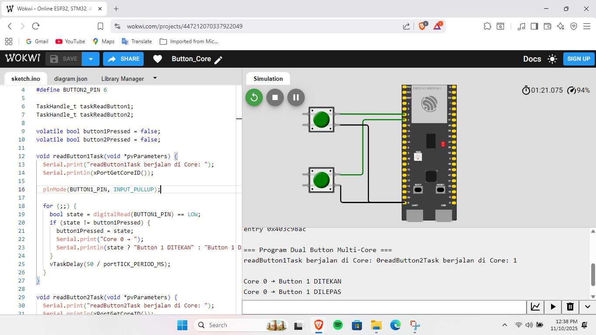
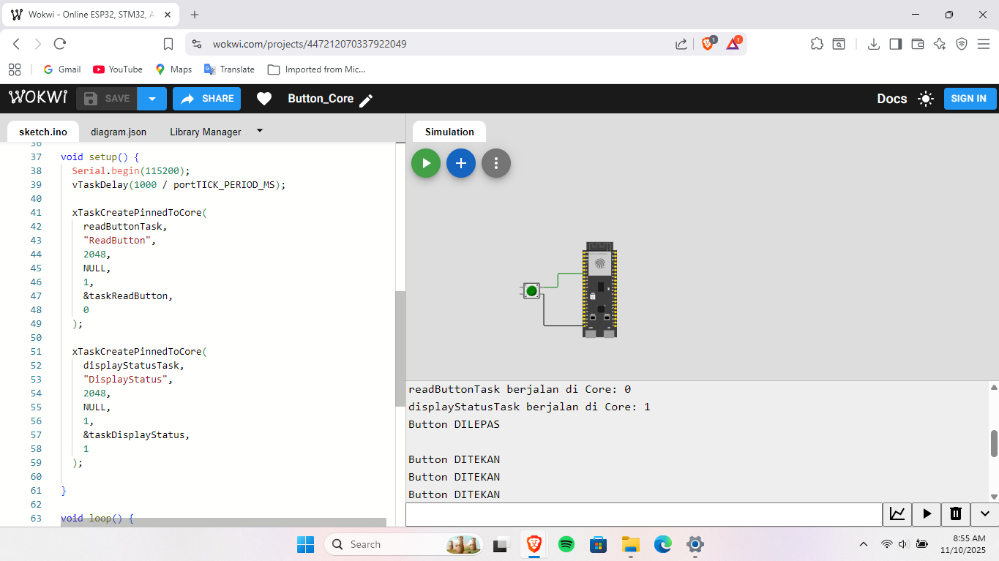

## Percobaan Button
Wokwi Project [Link](https://wokwi.com/projects/447212070337922049)
Percobaan ini bertujuan untuk membaca dua tombol (push button) menggunakan dua core prosesor ESP32.
Core 0 bertugas membaca Button 1, sementara Core 1 bertugas membaca Button 2.
Kedua core berjalan paralel dan menampilkan status tombol masing-masing secara independen di Serial Monitor.

## Penjelasan Kode
### 1. Definisi Pin dan Task
Dua pin digunakan untuk tombol dan dua task dibuat untuk menjalankan pembacaan secara paralel di dua core.
```c
#include <Arduino.h>

#define BUTTON1_PIN 7
#define BUTTON2_PIN 8

TaskHandle_t taskReadButton1;
TaskHandle_t taskReadButton2;

volatile bool button1Pressed = false;
volatile bool button2Pressed = false;
```
Masing-masing tombol terhubung ke pin GPIO 7 dan 8, dengan mode `INPUT_PULLUP`.
Dua variabel `volatile` digunakan agar data yang dibaca antar core tetap konsisten.

### 2. Task `readButton1Task`(Core 0)
Task pertama dijalankan di Core 0 untuk membaca status Button 1.
```c
void readButton1Task(void *pvParameters) {
  Serial.print("readButton1Task berjalan di Core: ");
  Serial.println(xPortGetCoreID());

  pinMode(BUTTON1_PIN, INPUT_PULLUP);

  for (;;) {
    bool state = digitalRead(BUTTON1_PIN) == LOW;
    if (state != button1Pressed) {
      button1Pressed = state;
      Serial.print("Core 0 → ");
      Serial.println(state ? "Button 1 DITEKAN" : "Button 1 DILEPAS");
    }
    vTaskDelay(50 / portTICK_PERIOD_MS);
  }
}
```
Tombol dibaca terus-menerus, dan hanya mencetak pesan ke Serial Monitor jika terjadi perubahan status (tekan/lepas).

### 3. Task `readButton2Task` (Core 1)
Task kedua dijalankan di Core 1 untuk membaca status Button 2.
```c
void readButton2Task(void *pvParameters) {
  Serial.print("readButton2Task berjalan di Core: ");
  Serial.println(xPortGetCoreID());

  pinMode(BUTTON2_PIN, INPUT_PULLUP);

  for (;;) {
    bool state = digitalRead(BUTTON2_PIN) == LOW;
    if (state != button2Pressed) {
      button2Pressed = state;
      Serial.print("Core 1 → ");
      Serial.println(state ? "Button 2 DITEKAN" : "Button 2 DILEPAS");
    }
    vTaskDelay(50 / portTICK_PERIOD_MS);
  }
}
```
Core 1 bekerja secara paralel dengan Core 0, sehingga masing-masing tombol dapat dideteksi secara independen tanpa saling menunggu.

### 4. Fungsi `setup()`
Fungsi ini digunakan untuk menginisialisasi komunikasi serial dan membuat task untuk kedua core.
```c
void setup() {
  Serial.begin(115200);
  vTaskDelay(1000 / portTICK_PERIOD_MS);
  Serial.println("\n=== Program Dual Button Multi-Core ===");

  xTaskCreatePinnedToCore(
    readButton1Task,
    "ReadButton1",
    2048,
    NULL,
    1,
    &taskReadButton1,
    0  // Core 0
  );

  xTaskCreatePinnedToCore(
    readButton2Task,
    "ReadButton2",
    2048,
    NULL,
    1,
    &taskReadButton2,
    1  // Core 1
  );
}
```
Dengan `xTaskCreatePinnedToCore()`, setiap fungsi pembaca tombol dikunci di core tertentu sehingga bisa berjalan dengan baik.

### 5. Fungsi `loop()`  
Loop utama dibiarkan kosong karena semua logika sudah dijalankan dalam task.
```c
void loop() {
  vTaskDelay(1000 / portTICK_PERIOD_MS);
}
```

## Hasil Percobaan
Percobaan menunjukkan bahwa kedua core mampu membaca tombol masing-masing dengan respon cepat dan independen.
Saat salah satu tombol ditekan, hanya core terkait yang menampilkan status di Serial Monitor.

Hasil Serial Monitor pada Core 0:
```shell
=== Program Dual Button Multi-Core ===
readButton1Task berjalan di Core: 0 readButton2Task berjalan di Core: 1

Core 0 → Button 1 DITEKAN
Core 0 → Button 1 DILEPAS
Core 1 → Button 2 DITEKAN
Core 1 → Button 2 DILEPAS
```

### Hasil Screenshot
---





Hasil Video Percobaan bisa diakses melalui link drive berikut:
[Percobaan Button](https://drive.google.com/file/d/1zTX2FChexWlB6IM7EctOILZNdJaKcMi5/view?usp=drive_link)
