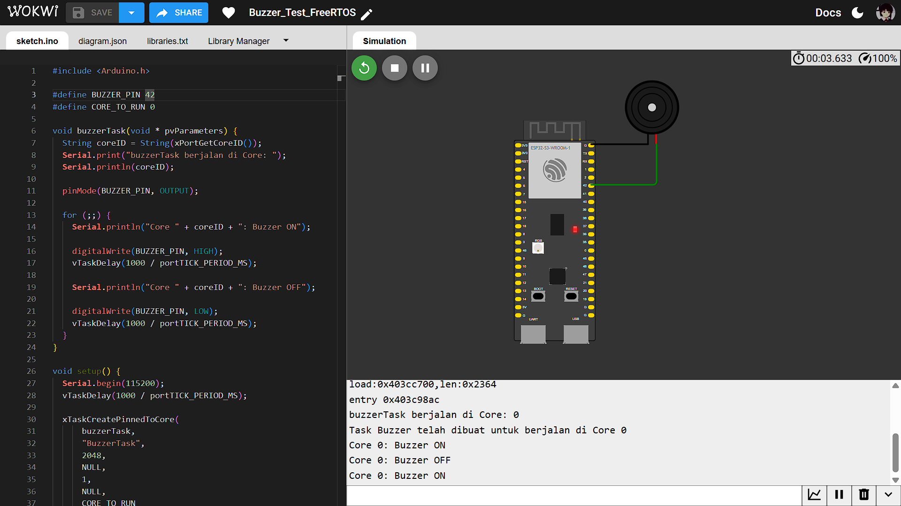
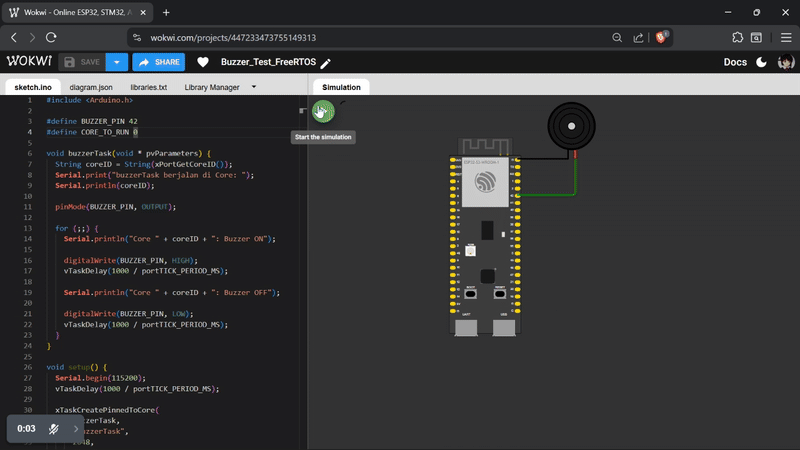

## Percobaan Buzzer

Percobaan untuk mengontrol sebuah *buzzer aktif* agar berbunyi (bip) secara periodik (hidup 1 detik, mati 1 detik) menggunakan sebuah task khusus. Task tersebut dijalankan pada salah satu core prosesor (Core 0 atau Core 1) untuk menguji kontrol I/O digital dasar.

## Penjelasan Kode

### 1. Definisi Pin dan Core
Pin untuk buzzer dan core target untuk menjalankan task didefinisikan di awal program.
```c
#define BUZZER_PIN 42
#define CORE_TO_RUN 0
````

`BUZZER_PIN` menentukan pin GPIO yang terhubung ke buzzer. `CORE_TO_RUN` (0 atau 1) menentukan di core mana task akan dieksekusi.

### 2. Task `buzzerTask`

Fungsi `buzzerTask` adalah task yang bertanggung jawab untuk logika membunyikan buzzer.

```c
void buzzerTask(void * pvParameters) {
  String coreID = String(xPortGetCoreID());
  Serial.print("buzzerTask berjalan di Core: ");
  Serial.println(coreID);

  pinMode(BUZZER_PIN, OUTPUT);

  for (;;) {
    Serial.println("Core " + coreID + ": Buzzer ON");
    digitalWrite(BUZZER_PIN, HIGH);
    vTaskDelay(1000 / portTICK_PERIOD_MS);

    Serial.println("Core " + coreID + ": Buzzer OFF");
    digitalWrite(BUZZER_PIN, LOW);
    vTaskDelay(1000 / portTICK_PERIOD_MS);
  }
}
```

Task ini pertama-tama mencetak core ID-nya untuk verifikasi. Kemudian, ia mengatur `BUZZER_PIN` sebagai `OUTPUT`. Dalam loop tak terbatas (`for (;;)`), lalu menyalakan buzzer (`HIGH`) selama 1 detik dan kemudian mematikannya (`LOW`) selama 1 detik. Fungsi `vTaskDelay()` digunakan untuk menunda eksekusi task tanpa memblokir core.

### 3. Fungsi `setup()`

Fungsi `setup()` dieksekusi sekali saat startup. Fungsi ini menginisialisasi komunikasi serial dan membuat task buzzer.

```c
void setup() {
  Serial.begin(115200);
  vTaskDelay(1000 / portTICK_PERIOD_MS);

  xTaskCreatePinnedToCore(
      buzzerTask,
      "BuzzerTask",
      2048,
      NULL,
      1,
      NULL,
      CORE_TO_RUN
  );

  Serial.println("Task Buzzer telah dibuat untuk berjalan di Core " + String(CORE_TO_RUN));
}
```

`xTaskCreatePinnedToCore` merupakan fungsi FreeRTOS untuk membuat task `buzzerTask` dengan nama "BuzzerTask", dengan alokasi stack 2048 byte, dan menempatkannya pada core prosesor yang spesifik (CORE_TO_RUN).

### 4. Fungsi `loop()`

Fungsi `loop()` (yang berjalan di Core 1) sengaja dibiarkan hanya berisi delay, karena semua logika utama untuk mengontrol buzzer sudah ditangani oleh `buzzerTask`.

```c
void loop() {
  vTaskDelay(1000 / portTICK_PERIOD_MS);
}
```

## Hasil Percobaan

Hasil percobaan menunjukkan bahwa baik Core 0 maupun Core 1 memiliki hasil yang sama untuk menjalankan dalam mengendalikan pin GPIO untuk menyalakan dan mematikan buzzer aktif.

Hasil Serial Monitor pada Core 0:

```shell
Task Buzzer telah dibuat untuk berjalan di Core 0
buzzerTask berjalan di Core: 0
Core 0: Buzzer ON
Core 0: Buzzer OFF
Core 0: Buzzer ON
Core 0: Buzzer OFF
```

Hasil Serial Monitor pada Core 1:

```shell
Task Buzzer telah dibuat untuk berjalan di Core 1
buzzerTask berjalan di Core: 1
Core 1: Buzzer ON
Core 1: Buzzer OFF
Core 1: Buzzer ON
Core 1: Buzzer OFF
```

## Hasil Screenshot Core 0


## Hasil Screenshot Core 1


## Hasil Vidio demo


Hasil Video Percobaan bisa diakses melalui link drive berikut:
[Percobaan Buzzer](https://drive.google.com/file/d/1Nis6ZLg0DUDegRkt0WOP2ZAGNJff4Pq9/view?usp=drive_link)
