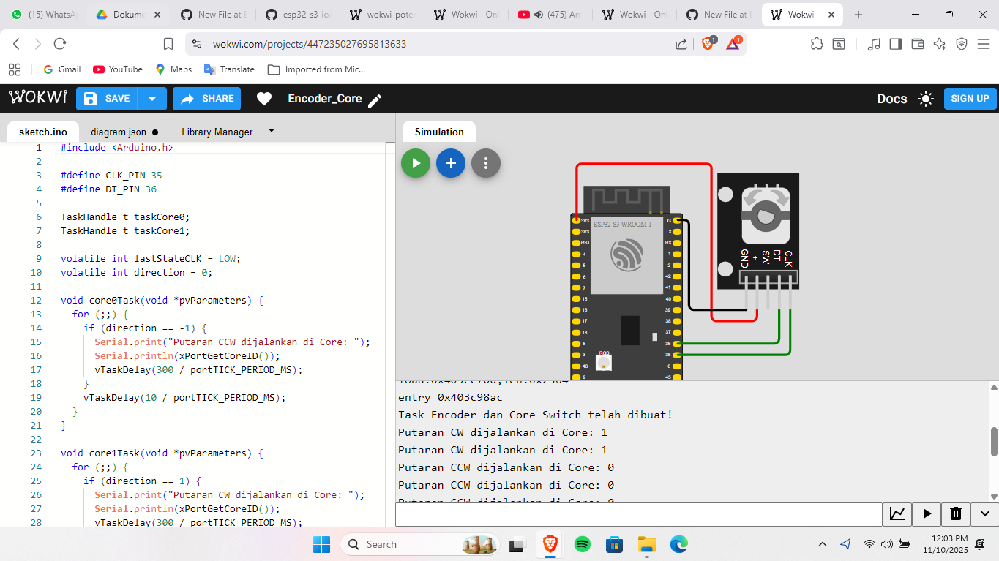

## Percobaan Rotary Encoder
Wokwi Project [Link](https://wokwi.com/projects/447235027695813633)
Percobaan ini bertujuan untuk membaca arah dan jumlah putaran dari sebuah **rotary encoder** menggunakan dua core pada **ESP32**.
Pada percobaan ini:
- `Core 0` digunakan untuk menangani **pembacaan sinyal encoder**.
- `Core 1` digunakan untuk **menampilkan hasil dan menentukan aksi berdasarkan arah putaran**.

## Penjelasan Kode
### 1. Definisi Pin dan Task
Pin `CLK` dan `DT` digunakan untuk membaca sinyal encoder.  
```c
#define CLK 18
#define DT 19

TaskHandle_t taskReadEncoder;
TaskHandle_t taskActionCore;

volatile int counter = 0;
volatile int lastStateCLK;
```
`counter` menyimpan nilai posisi encoder, sedangkan `lastStateCLK` digunakan untuk mendeteksi perubahan arah putaran.

### 2. Task `readEncoderTask`
Task ini dijalankan di Core 0 dan bertugas membaca arah perputaran dari rotary encoder.
```c
void readEncoderTask(void *pvParameters) {
  Serial.print("readEncoderTask berjalan di Core: ");
  Serial.println(xPortGetCoreID());

  lastStateCLK = digitalRead(CLK);

  for (;;) {
    int currentStateCLK = digitalRead(CLK);

    if (currentStateCLK != lastStateCLK) {
      if (digitalRead(DT) != currentStateCLK) {
        counter++;  // arah searah jarum jam
      } else {
        counter--;  // arah berlawanan jarum ja
      }
    }
    lastStateCLK = currentStateCLK;
    vTaskDelay(2 / portTICK_PERIOD_MS);
  }
}
```

### 3. Task `actionCoreTask`
Task ini dijalankan di Core 1 untuk menampilkan core mana yang sedang aktif berdasarkan arah putaran encoder.
```c
void actionCoreTask(void *pvParameters) {
  Serial.print("actionCoreTask berjalan di Core: ");
  Serial.println(xPortGetCoreID());

  int lastCounter = 0;
  for (;;) {
    if (counter > lastCounter) {
      Serial.println("Putaran searah jarum jam → Core 1 aktif");
    } 
    else if (counter < lastCounter) {
      Serial.println("Putaran berlawanan jarum jam → Core 0 aktif");
    }
    lastCounter = counter;
    vTaskDelay(300 / portTICK_PERIOD_MS);
  }
}
```

### 4. Fungsi `setup()`
Fungsi ini mengatur pin, memulai komunikasi serial, dan membuat task di masing-masing core.
```c
void setup() {
  Serial.begin(115200);
  pinMode(CLK, INPUT);
  pinMode(DT, INPUT);

  vTaskDelay(1000 / portTICK_PERIOD_MS);

  xTaskCreatePinnedToCore(readEncoderTask, "ReadEncoder", 2048, NULL, 1, &taskReadEncoder, 0);
  xTaskCreatePinnedToCore(actionCoreTask, "ActionCore", 2048, NULL, 1, &taskActionCore, 1);

  Serial.println("Task Encoder berhasil dibuat di Core 0 & Core 1");
}
```
Task `readPotTask` dijalankan di Core 0, dan `displayPotTask` dijalankan di Core 1 menggunakan `xTaskCreatePinnedToCore()`.

### 5. Fungsi `loop()`  
Fungsi loop tidak digunakan karena semua logika dijalankan oleh task yang berbeda.
```c
void loop() {
  vTaskDelay(1000 / portTICK_PERIOD_MS);
}
```

## Hasil Percobaan
Hasil percobaan menunjukkan bahwa saat encoder diputar:
- Jika diputar searah jarum jam (CW) → akan muncul pesan “Core 1 aktif”.
- Jika diputar berlawanan jarum jam (CCW) → akan muncul pesan “Core 0 aktif”.
  
Hasil Serial Monitor:
```shell
Task Encoder dan Core Switch telah dibuat!
Putaran CW dijalankan di Core: 1
Putaran CW dijalankan di Core: 1
Putaran CCW dijalankan di Core: 0
Putaran CCW dijalankan di Core: 0
Putaran CCW dijalankan di Core: 0
Putaran CW dijalankan di Core: 1
Putaran CW dijalankan di Core: 1
Putaran CW dijalankan di Core: 1
```

### Hasil Screenshot
---


Hasil Video Percobaan bisa diakses melalui link drive berikut:
[Percobaan Encoder](https://drive.google.com/file/d/1SurKcIZlFbojhfIzsFsyIf0HZJRjz4UU/view?usp=drive_link)
