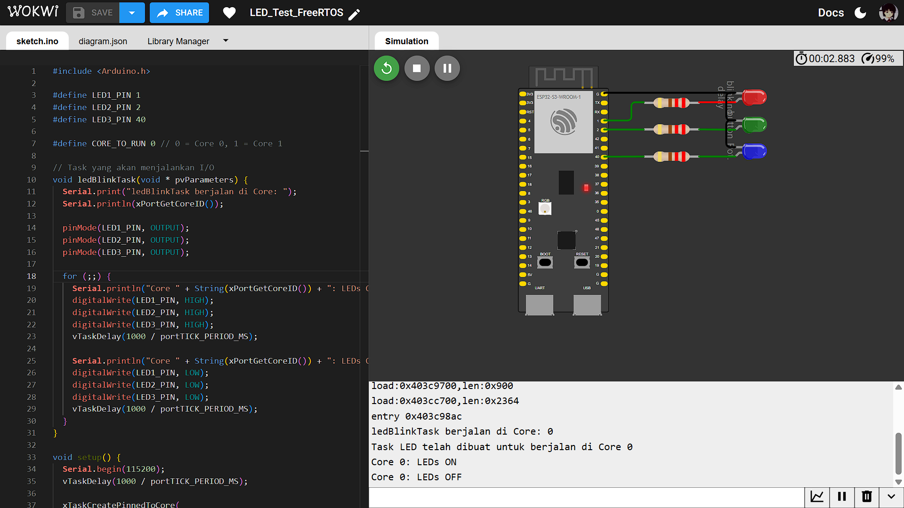

## Percobaan LED
Percobaan untuk mengontrol tiga buah LED agar berkedip secara bersamaan menggunakan sebuah task khusus. Task tersebut dijalankan pada salah satu core prosesor (Core 1) untuk memisahkan tugas I/O dari loop utama.

## Penjelasan Kode
### 1. Definisi Pin dan Core
Pin untuk tiga LED dan core target untuk menjalankan task didefinisikan di awal program.
```c
#define LED1_PIN 1
#define LED2_PIN 2
#define LED3_PIN 40

#define CORE_TO_RUN 1 // 0 = Core 0, 1 = Core 1
```
`LED1_PIN`, `LED2_PIN`, dan `LED3_PIN` menentukan pin GPIO yang terhubung ke masing-masing LED. Sedangkan CORE_TO_RUN menentukan di core mana task akan dijalankan. Nilai 1 berarti task akan berjalan di Core 1. Nilai 0 berarti task akan berjalan di Core 0.

### 2. Task `ledBlinkTask`
Fungsi `ledBlinkTask` adalah task yang bertanggung jawab untuk logika kedip LED.
```c
void ledBlinkTask(void * pvParameters) {
  // ... inisialisasi pin
  for (;;) {
    // Menyalakan LED
    digitalWrite(LED1_PIN, HIGH);
    digitalWrite(LED2_PIN, HIGH);
    digitalWrite(LED3_PIN, HIGH);
    vTaskDelay(1000 / portTICK_PERIOD_MS);

    // Mematikan LED
    digitalWrite(LED1_PIN, LOW);
    digitalWrite(LED2_PIN, LOW);
    digitalWrite(LED3_PIN, LOW);
    vTaskDelay(1000 / portTICK_PERIOD_MS);
  }
}
```

Task ini berjalan dalam satu loop tak terbatas (`for (;;)`). Dalam setiap iterasi, ketiga LED akan menyala (HIGH) selama 1 detik, kemudian mati (LOW) selama 1 detik. Fungsi `vTaskDelay()` digunakan untuk menunda eksekusi task tanpa memblokir prosesor.

### 3. Fungsi `setup()`
Fungsi `setup()` dieksekusi sekali saat startup. Fungsi ini menginisialisasi komunikasi serial dan membuat task LED.
```c
void setup() {
  Serial.begin(115200);
  // ...
  xTaskCreatePinnedToCore(
      ledBlinkTask,   // Fungsi task
      "LEDTask",      // Nama task
      2048,           // Ukuran stack
      NULL,           // Parameter
      1,              // Prioritas
      NULL,           // Handle task
      CORE_TO_RUN     // Core ID (0 atau 1)
  );
}
```

`Serial.begin(115200)` memulai komunikasi serial untuk melakukan debugging. Sedangkan, `xTaskCreatePinnedToCore` merupakan fungsi FreeRTOS untuk membuat task baru dan menempatkannya pada core prosesor yang spesifik (CORE_TO_RUN).

### 4. Fungsi `loop()`
Fungsi `loop()` sengaja dibiarkan hampir kosong karena semua logika utama untuk mengontrol LED sudah ditangani oleh ledBlinkTask yang berjalan secara independen.
```c
void loop() {
  vTaskDelay(1000 / portTICK_PERIOD_MS);
}
```

## Hasil Percobaan
Hasil percobaan menunjukkan bahwa baik Core 0 maupun Core 1 memiliki kemampuan yang sama untuk menjalankan tugas I/O, yaitu mengendalikan pin GPIO untuk mengedipkan lampu LED.

Hasil Serial Monitor pada Core 0:
```shell
ledBlinkTask berjalan di Core: 0
Task LED telah dibuat untuk berjalan di Core 0
Core 0: LEDs ON
Core 0: LEDs OFF
Core 0: LEDs ON
Core 0: LEDs OFF
```

Hasil Serial Monitor pada Core 1:
```shell
ledBlinkTask berjalan di Core: 1
Task LED telah dibuat untuk berjalan di Core 1
Core 1: LEDs ON
Core 1: LEDs OFF
Core 1: LEDs ON
Core 1: LEDs OFF
```

### Hasil Screenshot Core 0
---



### Hasil Screenshot Core 1
---


Hasil Video Percobaan bisa diakses melalui link drive berikut:
[Percobaan LED](https://drive.google.com/drive/folders/1OqfZi_s4daHbviH3SURqLsNjiEwmsmdw?usp=sharing)