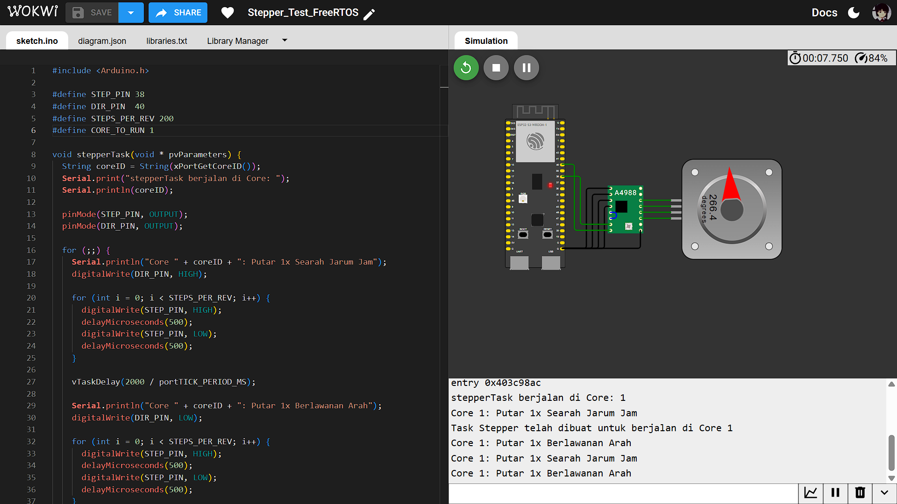
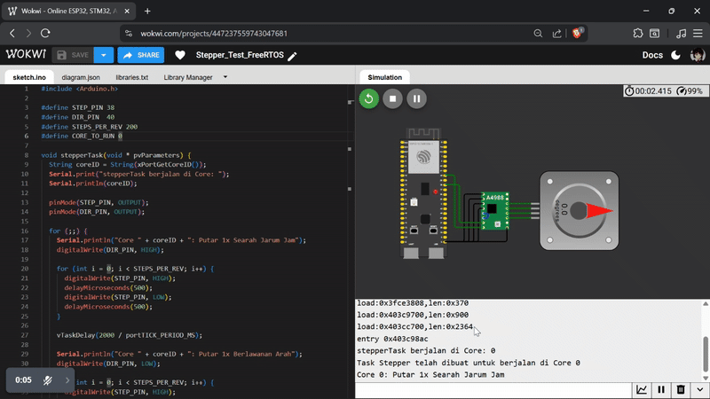

## Percobaan Motor Stepper (A4988)

Percobaan untuk mengontrol sebuah motor stepper melalui driver A4988. Tujuan utamanya adalah mengirimkan pulsa (pulse) `STEP` dan sinyal `DIR` (direction) dari sebuah task khusus yang berjalan di core spesifik.

## Penjelasan Kode

### 1. Definisi Pin dan Core

```c
#define STEP_PIN 38
#define DIR_PIN  40
#define STEPS_PER_REV 200
#define CORE_TO_RUN 1
````

`STEP_PIN` (GPIO 38) akan menerima pulsa untuk menggerakkan motor, dan `DIR_PIN` (GPIO 40) akan menentukan arah putaran. `STEPS_PER_REV` diset ke 200, standar untuk motor 1.8 derajat. `CORE_TO_RUN` menentukan di core mana task akan dieksekusi.

### 2. Task `stepperTask`

Fungsi `stepperTask` adalah task yang bertanggung jawab untuk logika pergerakan motor.

```c
void stepperTask(void * pvParameters) {
  String coreID = String(xPortGetCoreID());
  Serial.print("stepperTask berjalan di Core: ");
  Serial.println(coreID);

  pinMode(STEP_PIN, OUTPUT);
  pinMode(DIR_PIN, OUTPUT);

  for (;;) {
    Serial.println("Core " + coreID + ": Putar 1x Searah Jarum Jam");
    digitalWrite(DIR_PIN, HIGH);

    for (int i = 0; i < STEPS_PER_REV; i++) {
      digitalWrite(STEP_PIN, HIGH);
      delayMicroseconds(500);
      digitalWrite(STEP_PIN, LOW);
      delayMicroseconds(500);
    }

    vTaskDelay(2000 / portTICK_PERIOD_MS);

    Serial.println("Core " + coreID + ": Putar 1x Berlawanan Arah");
    digitalWrite(DIR_PIN, LOW);

    for (int i = 0; i < STEPS_PER_REV; i++) {
      // (kode pulsa diulang)
    }
   
    vTaskDelay(2000 / portTICK_PERIOD_MS);
  }
}
```
Tidak seperti I/O lain, motor stepper dikontrol dengan mengirimkan serangkaian pulsa cepat. Dalam hal ini, fungsi `delayMicroseconds()` digunakan untuk menciptakan jeda singkat sebesar 500 mikrodetik, yang merupakan durasi minimum yang diperlukan oleh driver A4988 untuk mendaftarkan satu langkah motor. Fungsi `vTaskDelay()` tidak cocok untuk tujuan ini karena hanya mendukung jeda dalam satuan milidetik, yang terlalu lambat untuk menghasilkan pulsa dengan kecepatan tinggi. Durasi jeda antar langkah ini juga secara langsung memengaruhi kecepatan rotasi motor.

### 3. Fungsi `setup()`

Fungsi `setup()` menginisialisasi Serial dan membuat task stepper.

```c
void setup() {
  Serial.begin(115200);
  vTaskDelay(1000 / portTICK_PERIOD_MS);

  xTaskCreatePinnedToCore(
      stepperTask,    // Fungsi task
      "StepperTask",  // Nama task
      2048,           // Ukuran stack
      NULL,           // Parameter
      2,              // Prioritas (dinaikkan)
      NULL,           // Handle task
      CORE_TO_RUN     // Core ID
  );

  Serial.println("Task Stepper telah dibuat untuk berjalan di Core " + String(CORE_TO_RUN));
}
```

Prioritas task diatur ke `2` (sedikit lebih tinggi dari default `1`) untuk membantu memastikan sinyal pulsa yang dikirim lebih stabil dan tidak mudah terganggu oleh task lain yang mungkin berjalan.

### 4. Fungsi `loop()`

Fungsi `loop()` dibiarkan kosong, karena semua logika pergerakan motor ditangani oleh `stepperTask`.

```c
void loop() {
  vTaskDelay(1000 / portTICK_PERIOD_MS);
}
```

## Hasil Percobaan

Hasil percobaan menunjukkan bahwa baik Core 0 maupun Core 1 mampu menghasilkan sinyal pulsa digital berkecepatan tinggi yang diperlukan untuk menggerakkan motor stepper. Motor berputar 1 putaran penuh di kedua arah pada kedua skenario pengujian.

Hasil Serial Monitor pada Core 0:

```shell
stepperTask berjalan di Core: 0
Task Stepper telah dibuat untuk berjalan di Core 0
Core 0: Putar 1x Searah Jarum Jam
Core 0: Putar 1x Berlawanan Arah
Core 0: Putar 1x Searah Jarum Jam
```

Hasil Serial Monitor pada Core 1:

```shell
stepperTask berjalan di Core: 1
Task Stepper telah dibuat untuk berjalan di Core 1
Core 1: Putar 1x Searah Jarum Jam
Core 1: Putar 1x Berlawanan Arah
Core 1: Putar 1x Searah Jarum Jam
```

### Hasil Screenshot Core 0


### Hasil Screenshot Core 1



### Hasil Video Demo



Hasil Video Percobaan bisa diakses melalui link drive berikut:
[Percobaan Motor Stepper](https://drive.google.com/file/d/1tolo3iA76OpiCzf9Pa_t38yACZe9JFQC/view?usp=drive_link)
