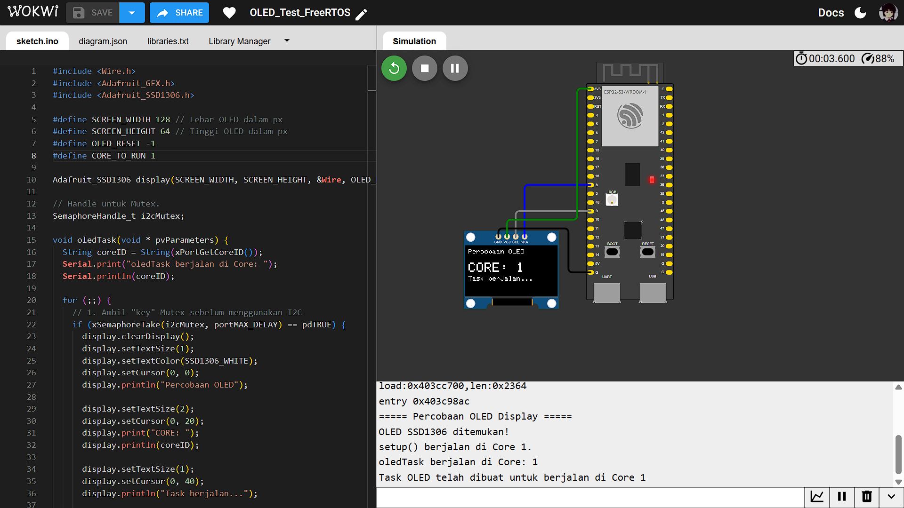
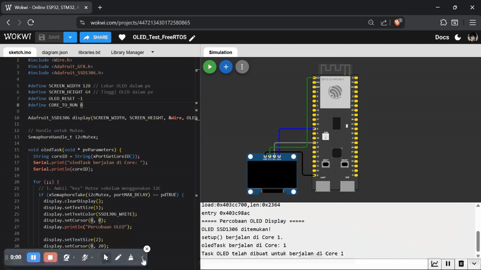

## Percobaan OLED (I2C)
Percobaan untuk menampilkan data ke layar OLED menggunakan sebuah task khusus. Task tersebut dijalankan pada salah satu core prosesor (Core 0 atau Core 1) untuk menguji akses ke periferal I2C dari core yang spesifik dan mengenalkan konsep proteksi sumber daya (Mutex).

### 1. Inisialisasi Library, Pin, dan Core
```c
#include <Wire.h>
#include <Adafruit_GFX.h>
#include <Adafruit_SSD1306.h>

#define SCREEN_WIDTH 128 // Lebar OLED dalam px
#define SCREEN_HEIGHT 64 // Tinggi OLED dalam px
#define OLED_RESET -1
#define CORE_TO_RUN 1

Adafruit_SSD1306 display(SCREEN_WIDTH, SCREEN_HEIGHT, &Wire, OLED_RESET);
```

Pin I2C (SDA di GPIO 8, SCL di GPIO 9) sudah terdefinisi secara default oleh &Wire. CORE_TO_RUN menentukan di core mana task akan dijalankan.

### 2. Proteksi I2C (Mutex)
I2C adalah bus "shared resource". Jika dua task dari core berbeda mencoba mengaksesnya bersamaan, bus bisa crash. Untuk melindunginya, digunakan 'Mutex' (Mutual Exclusion) dari FreeRTOS.
```c
SemaphoreHandle_t i2cMutex;
```
kode di atas merupakan adalah "key" digital. Hanya task yang memegang "key" yang boleh menggunakan bus I2C.

### 3. Task `oledTask`
Fungsi `oledTask` adalah task yang bertanggung jawab untuk logika menampilkan data ke OLED.
```c
void oledTask(void * pvParameters) {
  String coreID = String(xPortGetCoreID());
  Serial.print("oledTask berjalan di Core: ");
  Serial.println(coreID);

  for (;;) {
    // 1. Ambil "key" Mutex sebelum menggunakan I2C
    if (xSemaphoreTake(i2cMutex, portMAX_DELAY) == pdTRUE) {
      display.clearDisplay();
      display.setTextSize(1);
      display.setTextColor(SSD1306_WHITE);
      display.setCursor(0, 0);
      display.println("Percobaan OLED");

      display.setTextSize(2);
      display.setCursor(0, 20);
      display.print("CORE: ");
      display.println(coreID);

      display.setTextSize(1);
      display.setCursor(0, 40);
      display.println("Task berjalan...");

      display.display();

      // 2. Kembalikan "key" Mutex
      xSemaphoreGive(i2cMutex);
    }

    vTaskDelay(1000 / portTICK_PERIOD_MS);
  }
}
```

Setiap kali melakukan display, task harus "mengambil" Mutex (xSemaphoreTake), dan setelah selesai, "mengembalikan" Mutex (xSemaphoreGive).

### 4. Fungsi `setup()`
Fungsi `setup()` menginisialisasi Serial, Mutex, layar OLED, dan membuat task utama.
```c
void setup() {
  Serial.begin(115200);

  i2cMutex = xSemaphoreCreateMutex();

  if (xSemaphoreTake(i2cMutex, portMAX_DELAY) == pdTRUE) {
    if (!display.begin(SSD1306_SWITCHCAPVCC, 0x3C)) {
      Serial.println(F("Alokasi SSD1306 gagal"));
      for (;;);
    }
    display.clearDisplay();
    display.display();
    xSemaphoreGive(i2cMutex);
  }

  Serial.println("setup() berjalan di Core 1.");

  xTaskCreatePinnedToCore(
      oledTask,       // Fungsi task
      "OLEDTask",     // Nama task
      4096,           // Ukuran stack (OLED butuh > 2048)
      NULL,           // Parameter
      1,              // Prioritas
      NULL,           // Handle task
      CORE_TO_RUN     // Core ID (0 atau 1)
  );
}
```

### 5. Fungsi loop()
Fungsi loop() (yang berjalan di Core 1) sengaja dibiarkan kosong karena semua logika utama untuk OLED sudah ditangani oleh oledTask.
```c
void loop() {
  vTaskDelay(1000 / portTICK_PERIOD_MS);
}
```

## Hasil Percobaan
Hasil percobaan menunjukkan bahwa baik Core 0 maupun Core 1 memiliki kemampuan yang sama untuk menjalankan tugas I/O, yaitu mengendalikan periferal I2C untuk menulis data ke layar OLED.

Hasil fungsional (teks "CORE: 0" atau "CORE: 1" di OLED) teramati dengan benar pada kedua skenario pengujian.

Hasil Serial Monitor pada Core 0:
```shell
===== Percobaan OLED Display =====
OLED SSD1306 ditemukan!
setup() berjalan di Core 1.
Task OLED telah dibuat untuk berjalan di Core 0
oledTask berjalan di Core: 0
```

Hasil Serial Monitor pada Core 1:
```shell
===== Percobaan OLED Display =====
OLED SSD1306 ditemukan!
setup() berjalan di Core 1.
Task OLED telah dibuat untuk berjalan di Core 1
oledTask berjalan di Core: 1
```

## Hasil Screenshot Core 0


## Hasil Screenshot Core 1


## Hasil Video Demo


Hasil Video Percobaan bisa diakses melalui link drive berikut:
[Percobaan OLED](https://drive.google.com/file/d/1VDUDtppt6PCeDPG2iVnSeIYGnLH-jEgp/view?usp=drive_link)
