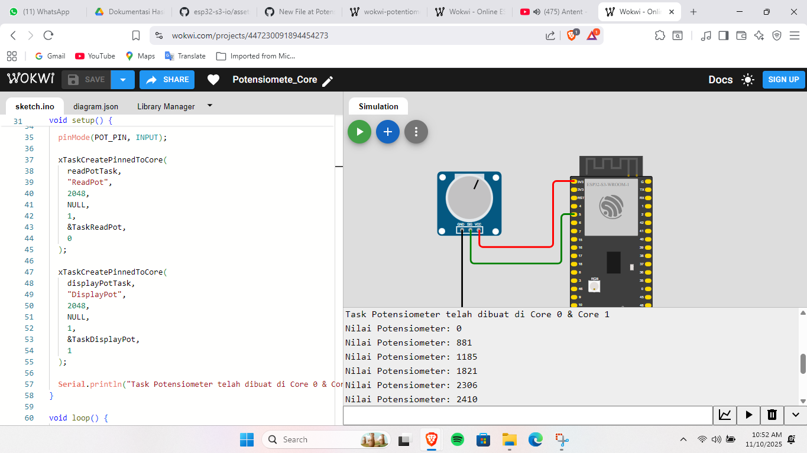

## Percobaan Potensiometer
Wokwi Project [Link](https://wokwi.com/projects/447230091894454273)
Percobaan ini bertujuan untuk membaca nilai analog dari sebuah **potensiometer** menggunakan core.  
`Core 0` bertugas membaca nilai ADC dari pin input, sedangkan `Core 1` menampilkan nilai tersebut secara periodik di Serial Monitor.

## Penjelasan Kode
### 1. Definisi Pin dan Task
Pin yang digunakan untuk potensiometer serta deklarasi task ditulis di bagian awal.
```c
#define POT_PIN 5

TaskHandle_t taskReadPot;
TaskHandle_t taskDisplayPot;

volatile int potValue = 0;
```
`POT_PIN` menentukan pin ADC yang digunakan untuk membaca nilai analog.
`potValue` diset sebagai `volatile` agar bisa dibaca di dua core tanpa ada bertabrakan.

### 2. Task `readPotTask`
Task ini dijalankan di Core 0 dan membaca nilai analog dari potensiometer.
```c
void readPotTask(void *pvParameters) {
  Serial.print("readPotTask berjalan di Core: ");
  Serial.println(xPortGetCoreID());

  for (;;) {
    potValue = analogRead(POT_PIN);
    vTaskDelay(50 / portTICK_PERIOD_MS);
  }
}
```
Fungsi `analogRead()` mengembalikan nilai antara 0–4095 untuk input 0–3.3V.
Delay kecil (`50 ms`) membantu menjaga pembacaan tetap stabil.

### 3. Task `displayPotTask`
Task ini berjalan di Core 1 dan menampilkan nilai hasil pembacaan ke Serial Monitor.
```c
void displayPotTask(void *pvParameters) {
  Serial.print("displayPotTask berjalan di Core: ");
  Serial.println(xPortGetCoreID());

  for (;;) {
    Serial.print("Nilai Potensiometer: ");
    Serial.println(potValue);
    vTaskDelay(500 / portTICK_PERIOD_MS);
  }
}
```
Nilai `potValue` diambil dari hasil pembacaan Core 0.
Setiap 500 ms, nilainya ditampilkan agar mudah dibaca di Serial Monitor.

### 4. Fungsi `setup()`
Fungsi setup() menginisialisasi komunikasi serial dan membuat dua task.
```c
void setup() {
  Serial.begin(115200);
  vTaskDelay(1000 / portTICK_PERIOD_MS);

  pinMode(POT_PIN, INPUT);

  xTaskCreatePinnedToCore(readPotTask, "ReadPot", 2048, NULL, 1, &taskReadPot, 0);
  xTaskCreatePinnedToCore(displayPotTask, "DisplayPot", 2048, NULL, 1, &taskDisplayPot, 1);

  Serial.println("Task Potensiometer berhasil dibuat di Core 0 & Core 1");
}
```
Task `readPotTask` dijalankan di Core 0, dan `displayPotTask` dijalankan di Core 1 menggunakan `xTaskCreatePinnedToCore()`.

### 5. Fungsi `loop()`  
Fungsi loop tidak digunakan karena semua logika dijalankan oleh task yang berbeda.
```c
void loop() {
  vTaskDelay(1000 / portTICK_PERIOD_MS);
}
```

## Hasil Percobaan
Hasil percobaan menunjukkan bahwa nilai potensiometer berubah sesuai dengan posisi knob, dan pembacaan dilakukan secara real-time di Serial Monitor.

Hasil Serial Monitor:
```shell
readPotTask berjalan di Core: 0 displayPotTask berjalan di Core: 1
Task Potensiometer telah dibuat di Core 0 & Core 1

Nilai Potensiometer: 0
Nilai Potensiometer: 881
Nilai Potensiometer: 1185
Nilai Potensiometer: 1821
Nilai Potensiometer: 2306
Nilai Potensiometer: 2410
```

### Hasil Screenshot
---


Hasil Video Percobaan bisa diakses melalui link drive berikut:
[Percobaan Potensio](https://drive.google.com/file/d/1iEv4jGHrobTggerbS6L2pAjj7bi5juqO/view?usp=drive_link)
